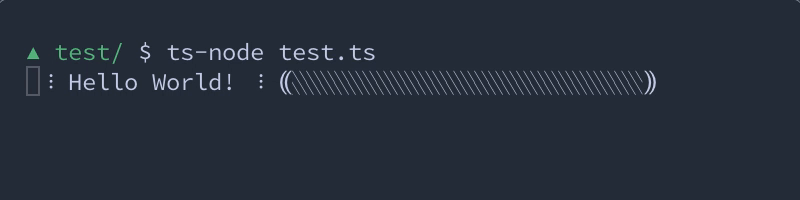

# flex-progress

> CLI progress bar made simple

```typescript
import * as FlexProgress from '@dinoabsoluto/flex-progress-js'

const out = new FlexProgress.Output()
const bar = new FlexProgress.Bar({ width: 25 })

out.append(
  new FlexProgress.Spinner()
, 1 , 'Hello World!' , 1
, new FlexProgress.Spinner()
, 1, '⸨', bar , '⸩'
)

let count = 0
const loop = setInterval(() => {
  count++
  bar.ratio = (count % 41) / 40
}, 40)
```


