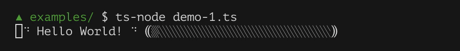
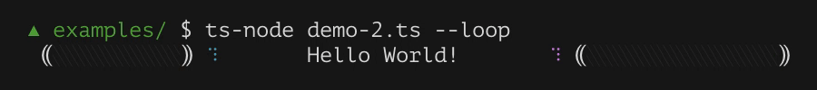
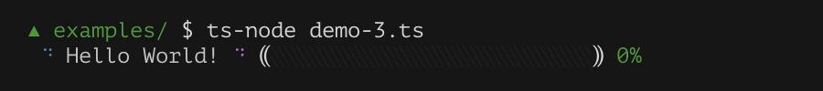

# flex-progress

> CLI progress bar made simple

[](https://travis-ci.org/dino-absoluto/flex-progress-js)
[](https://coveralls.io/github/dino-absoluto/flex-progress-js?branch=master)
[](https://badge.fury.io/js/%40dinoabsoluto%2Fflex-progress)

An object-oriented approach to progress bar.

- **Simple:** no template, no ticking, just change the `ratio` property and
you're good to go.
- **Theme:** personalize with colors and style.
- **Object-oriented:** each element is an object, updating its data leads to
updating the output.
No need to care about what other elements are doing.

```javascript
const FlexProgress = require('@dinoabsoluto/flex-progress')
// ESModules or Typescript
// import * as FlexProgress from '@dinoabsoluto/flex-progress'

const out = new FlexProgress.Output()
const bar = new FlexProgress.Bar({ width: 25 })

out.append(
  1, new FlexProgress.Spinner(),
  1, 'Hello World!',
  1, new FlexProgress.Spinner(),
  1, '⸨', bar, '⸩'
)

let count = 0
const loop = setInterval(() => {
  count++
  bar.ratio = (count % 39) / 38
}, 80)

```







**NOTE:** The images above are screen captures of the demos in folder examples.

## Concept: Why is it *flex*-progress?
This was inspired by CSS Flexbox concept, although much simpler.

Basically, all elements have `flexShrink` and `flexGrow` properties,
which controls how much they shrink/grow. (`flex` is a shorthand for both)

In most case, you'll want your progress `Bar` to have fixed width and a `Text`
with `flexShrink` set to 1. This way, your text will fill up the
CLI width, but will truncate at the end of the line.

## Usage
See [documents](docs/index.md) for more details.

For a simple explanation see the example below.

```javascript
// Import the library.
const FlexProgress = require('@dinoabsoluto/flex-progress')
// ESModules or Typescript
// import * as FlexProgress from '@dinoabsoluto/flex-progress'

// We're gonna use colors for this tutorial so here's we go.
const c = require('kleur')

// First, create an `Output`.
// This controls what appears onscreen.
const out = new FlexProgress.Output()

// Next, create a progress `Bar`.
// The progress `Bar` by itself doesn't do anything.
// Only when adding to `Output` that it appears onscreen.
const bar = new FlexProgress.Bar({ width: 25 })

// Sometime visual is not enough, people want concrete number instead.
// Let's create a label to report that number.
const label = new FlexProgress.Text()

// Okay, add stuffs to your `Output`.
// This makes them appear onscreen.
out.append(
  // 1 means 1 space.
  1,

  // Add a spinner.
  new FlexProgress.Spinner(),

  // Another space and some text, basically, you can add space as text.
  // e.g. ' Hello World! '
  // But, we're using numbers to show what it does.
  1, 'Hello World!',

  // Well, 1 spinner is a little too few I suppose, here's another, with color.
  //
  // The `postProcess` function receives the rendered texts
  // and returns processed text, the visual length must remain the same.
  // *Visual*, that is to say ANSI escape codes don't count.
  1, new FlexProgress.Spinner({ postProcess: c.red }),

  // Finally, the progress bar's here.
  1, '⸨', bar, '⸩',

  // Of course, don't forget the `label`.
  1, label
)

// Now you have spinners, a bar and a label, but nothing to do, so let's count
let count = 0
const loop = setInterval(() => {
  count++

  // Set the `ratio` property of the progress `Bar`.
  //
  // The value is clamped to range [0, 1].
  //
  // There's no need for ticking, just set this value whenever you want
  // and it'll get updated.
  // And there's no need for order as well.
  // Go from 0% to 100%, 100% to 0% or some random beat, whatever your choice.
  bar.ratio = (count % 39) / 38

  // Now report that number as text.
  // The most basic is, of course, percentage.
  // But you can set this label to any random text you want. Be it:
  // - Elapsed time
  // - ETA
  // - Speed
  // - Some random chitchat to idle time away
  // This library doesn't calculate any of these, since only you who control
  // the works know the best algorithm to calculate the time.
  label.text = Math.round(bar.ratio * 1000) / 10 + '%'

  // Now a question, you changed the values of `bar.ratio` and `label.text`
  // So that made the screen updated twice, right?
  //
  // Wrong. Only one update is scheduled and processed later.
  // Any changes in the meantime will be merged and updated together.
  //
  // And of course, no unnecessary updates if there's no changes.
  // The same text won't be rendered repeatedly.
  // After all there's no need for a progress bar that's too busy reporting
  // progress to make any progress.
}, 80)

// Can't be counting forever.
// You need to get back to coding so let's end the loop.
setTimeout(() => {
  clearInterval(loop)
  // Remember to clear your `Output`.
  // Or else your progress bar will remain onscreen even after exiting.
  out.clear()
}, 10000)
```
