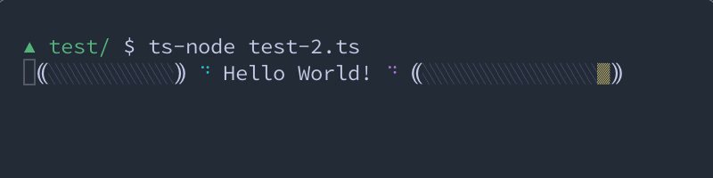

# flex-progress

> CLI progress bar made simple

An object-oriented approach to progress bar.

- **Simple:** no template, no ticking, just change the `ratio` property and
you're good to go.
- **Theme:** personalize with colors and style.
- **Object-oriented:** each element is an object, updating its data leads to
updating the output.
No need to care about what others elements are doing.

```typescript
import * as FlexProgress from '@dinoabsoluto/flex-progress-js'

const out = new FlexProgress.Output()
const bar = new FlexProgress.Bar({ width: 25 })

out.append(
  1, new FlexProgress.Spinner()
, 1, 'Hello World!'
, 1, new FlexProgress.Spinner()
, 1, '⸨', bar , '⸩'
)

let count = 0
const loop = setInterval(() => {
  count++
  bar.ratio = (count % 39) / 38
}, 40)
```



